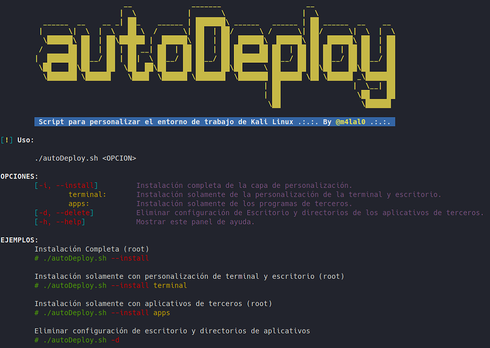

# autoDeploy

[](#)
[](#)
[](#)
[](#)


AutoDeploy es un script que permite instalar una capa de personalización en Kali Linux OS. Instala diferentes plugins, aplicaciones y utilidades para tener un entorno más agradable para trabajar.

## Instalación y Uso

Ejecutarlo como root:

```
git clone https://github.com/m4lal0/autoDeploy
cd autoDeploy; chmod +x autoDeploy.sh
./autoDeploy.sh
```

Al ejecutarlo nos mostrará un panel de ayuda:



El script cuenta con **3** modos de instalación:
##### Instalación completa
```sh
./autoDeploy.sh --install
```
##### Instalar personalización de terminal y escritorio xfce
```sh
./autoDeploy.sh --install terminal
```
##### Instalar aplicaciones de terceros
```sh
./autoDeploy.sh --install apps
```

Al inicio solicitará unos datos para el proceso de instalación, el resto de la ejecución debería de realizarse automáticamente sin necesitar interacción del usuario. Si algún paso de la instalación falla, se almacena una copia del error en el fichero **error.log** para que estos puedan ser solucionados posteriormente de forma manual.

## Utilidades


Estas son algunas de las aplicaciones y utilidades que se incluyen en esta capa de personalización:

#### PERSONALIZACION DE ESCRITORIO Y TERMINAL

<details>
<summary>Fonts</summary>

- Hacker Nerd
- Fira Code

</details>

<details>
<summary>Desktop Custom</summary>

- xfce custom
- rofi
- i3lock-fancy
- Notifications custom
- Candy-icons
- Wallpapers

</details>

<details>
<summary>Terminal</summary>

- zsh
- zsh plugins
- lsd
- bat
- fzf
- fd-find
- cheat
- powerlevel10k
- Oh my Tmux!
- mate terminal custom
- terminator

</details>

#### HERRAMIENTAS ADICIONALES

<details>
<summary>Web Browser</summary>

- Firefox
- Brave
- TOR Browser

</details>

<details>
<summary>Recon tools</summary>

- Port Scanning
	- amass
	- Naabu
- Subdomains
	- Subblist3r
	- SubFinder
	- Assetfinder
	- Subbrute
	- AltDNS
	- httprobe
- DNS Lookups
	- Hakrevdns
	- dnsx
	- DNSGen
	- MassDNS
- Crawler
	- Hakrawler
	- Evine
	- Certgraph
- Fuzzer
	- Dirsearch
	- GoBuster
	- ffuf
	- URLBuster
	- CRLFuzz
	- Cross Site Scripting
	- XXStrike
	- Uniscan
	- Feroxbuster
- CMS
	- WAScan
	- CMSeeK
	- WPSeku
	- Vulnx
	- Droopescan
	- Wordpress-Exploit-Framework
	- Drupwn
	- Typo3Scan
	- WPForce
	- joomlavs
	- jscanner
- Metadata
	- Metagoofil

</details>

<details>
<summary>Wordlists & Wordlist Tools</summary>

- Fuzzdb
- Seclists
- Cupp
- CWFF

</details>

<details>
<summary>Brute Force</summary>

- crowbar
- BruteMap
- sucrack

</details>

<details>
<summary>Cracking & Password Attacks</summary>

- HashCat
- Hashid
- Pyrit
- Decodify

</details>

<details>
<summary>OS Enumeration</summary>

- htbenum
- linux-smart-enumeration
- LinEnum
- pspy
- Windows Exploit Suggerter (WES-NG)
- PrivescCheck
- Unix-Privesc-Check
- WinPwn
- JAWS

</details>

<details>
<summary>Active Directory Tools</summary>

- CrackMapExec
- Nishang
- PowerSploit
- ADRecon

</details>

<details>
<summary>Reverse shell</summary>

- rlwrap
- pwncat
- GTFOBLookup
- revshellgen
- Rustcat

</details>

<details>
<summary>Developer Tools</summary>

- Golang
- html2text
- Virtualenv
- pipenv
- Impacket-Python

</details>

<details>
<summary>Networking Tools</summary>

- Htop
- bpytop
- Gotop
- BashTOP
- Updog
- httpx
- SMBGhost
- Chisel
- WhatMask
- GoDoH
- DNScat2
- Apple-bleee

</details>

<details>
<summary>OSINT Tools</summary>

- steghide
- twint
- Sherlock-Project
- userSearch
- go-Dork
- OSRFramework

</details>

<details>
<summary>Phishing Tools</summary>

- SocialFish
- Zphisher
- Maskphish
- FAQUE

</details>

<details>
<summary>Wifi Tools</summary>

- Xerosploit
- Airgeddon
- WifiAttack
- PSKracker
- Airgraph-ng
- hostapd-mana

</details>

<details>
<summary>Utilities</summary>

- xClip
- LibreOffice
- Thunderbird
- LaTeX
- NordVPN
- Tempomail
- Pandoc
- SauronEye
- feh
- Trash-cli
- Firejail

</details>

<br>

> Y muchas más herramientas...