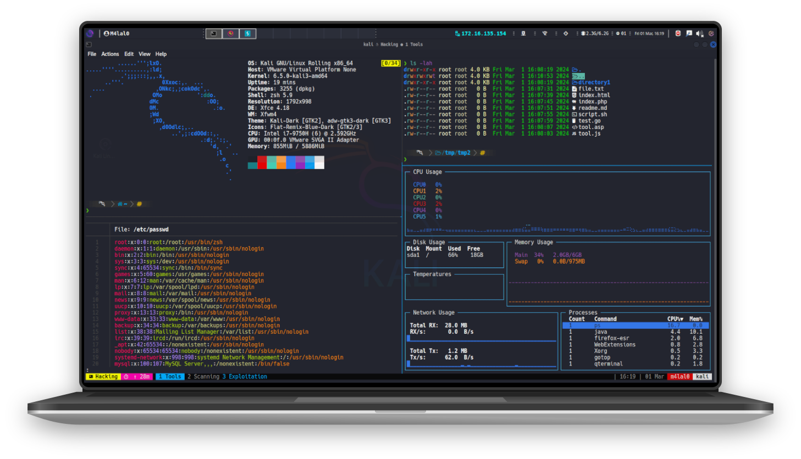

# autoDeploy

[](#)
[](#)
[](#)
[](#)
[](#)



<h4 align="center">AutoDeploy es un script en bash que permite instalar una capa de personalización en Kali Linux OS. Instala diferentes plugins, aplicaciones y utilidades para tener un entorno más agradable para trabajar.</h4><br>

---

## Descarga

Descargar el proyecto y darle permisos de ejecución:

```
git clone https://github.com/m4lal0/autoDeploy
cd autoDeploy; chmod +x autoDeploy.sh
```

## ¿Cómo usarlo?

```
                             __              _______                    __                   
                            |  \            |       \                  |  \                  
          ______  __    __ _| ▓▓_    ______ | ▓▓▓▓▓▓▓\ ______   ______ | ▓▓ ______  __    __ 
         |      \|  \  |  \   ▓▓ \  /      \| ▓▓  | ▓▓/      \ /      \| ▓▓/      \|  \  |  \
          \▓▓▓▓▓▓\ ▓▓  | ▓▓\▓▓▓▓▓▓ |  ▓▓▓▓▓▓\ ▓▓  | ▓▓  ▓▓▓▓▓▓\  ▓▓▓▓▓▓\ ▓▓  ▓▓▓▓▓▓\ ▓▓  | ▓▓
         /      ▓▓ ▓▓  | ▓▓ | ▓▓ __| ▓▓  | ▓▓ ▓▓  | ▓▓ ▓▓    ▓▓ ▓▓  | ▓▓ ▓▓ ▓▓  | ▓▓ ▓▓  | ▓▓
        |  ▓▓▓▓▓▓▓ ▓▓__/ ▓▓ | ▓▓|  \ ▓▓__/ ▓▓ ▓▓__/ ▓▓ ▓▓▓▓▓▓▓▓ ▓▓__/ ▓▓ ▓▓ ▓▓__/ ▓▓ ▓▓__/ ▓▓
         \▓▓    ▓▓\▓▓    ▓▓  \▓▓  ▓▓\▓▓    ▓▓ ▓▓    ▓▓\▓▓     \ ▓▓    ▓▓ ▓▓\▓▓    ▓▓\▓▓    ▓▓
          \▓▓▓▓▓▓▓ \▓▓▓▓▓▓    \▓▓▓▓  \▓▓▓▓▓▓ \▓▓▓▓▓▓▓  \▓▓▓▓▓▓▓ ▓▓▓▓▓▓▓ \▓▓ \▓▓▓▓▓▓ _\▓▓▓▓▓▓▓
                                                              | ▓▓                 |  \__| ▓▓
                                                              | ▓▓                  \▓▓    ▓▓
                                                               \▓▓                   \▓▓▓▓▓▓ 

         Script para personalizar el entorno de trabajo de Kali Linux .:.:. By @m4lal0 .:.:. 


[!] Uso:

        ./autoDeploy.sh [OPCION]

OPCIONES:
        -i, --install         Instalación completa de la capa de personalización.
              terminal:       Instalación solamente de la personalización de la terminal y escritorio.
              apps:           Instalación solamente de los programas de terceros.
        -d, --delete          Eliminar configuración de Escritorio y directorios de los aplicativos de terceros.
        -h, --help            Mostrar este panel de ayuda.
```

El script cuenta con **3** modos de instalación:
##### Instalación completa
```sh
./autoDeploy.sh --install
```
##### Instalar personalización de terminal y escritorio xfce
```sh
./autoDeploy.sh --install terminal
```
##### Instalar aplicaciones de terceros
```sh
./autoDeploy.sh --install apps
```

Al inicio solicitará unos datos para el proceso de instalación, el resto de la ejecución debería de realizarse automáticamente sin necesitar interacción del usuario. Si algún paso de la instalación falla, se almacena una copia del error en el fichero **error.log** para que estos puedan ser solucionados posteriormente de forma manual.

## Utilidades

Estas son algunas de las aplicaciones y utilidades que se incluyen en esta capa de personalización:

#### PERSONALIZACION DE ESCRITORIO Y TERMINAL

<details>
<summary>Fonts</summary>

- Hacker Nerd

</details>

<details>
<summary>Desktop Custom</summary>

- xfce custom
- rofi
- findex
- i3lock-fancy
- Notifications custom
- Candy-icons
- Wallpapers

</details>

<details>
<summary>Terminal</summary>

- zsh
- zsh plugins
- lsd
- bat
- fzf
- fd-find
- cheat
- powerlevel10k
- Oh my Tmux!
- qterminal custom
- terminator

</details>

#### HERRAMIENTAS ADICIONALES

<details>
<summary>Web Browser</summary>

- Firefox
- Brave
- TOR Browser

</details>

<details>
<summary>Recon tools</summary>

- Port Scanning
	- amass
	- Naabu
	- RustScan
- Subdomains
	- Subblist3r
	- SubFinder
	- Assetfinder
	- Subbrute
	- AltDNS
	- httprobe
- DNS Lookups
	- Hakrevdns
	- dnsx
	- DNSGen
	- MassDNS
- Crawler
	- Hakrawler
	- Evine
	- Certgraph
- Fuzzer
	- Dirsearch
	- GoBuster
	- ffuf
	- URLBuster
	- CRLFuzz
	- Cross Site Scripting
	- XXStrike
	- Uniscan
	- Feroxbuster
- CMS
	- WAScan
	- CMSeeK
	- WPSeku
	- Vulnx
	- Droopescan
	- Wordpress-Exploit-Framework
	- Drupwn
	- Typo3Scan
	- WPForce
	- joomlavs
	- jscanner
- Metadata
	- Metagoofil

</details>

<details>
<summary>Wordlists & Wordlist Tools</summary>

- Fuzzdb
- Seclists
- Cupp
- CWFF

</details>

<details>
<summary>Brute Force</summary>

- crowbar
- BruteMap
- sucrack

</details>

<details>
<summary>Cracking & Password Attacks</summary>

- HashCat
- Hashid
- Pyrit
- Decodify

</details>

<details>
<summary>OS Enumeration</summary>

- htbenum
- linux-smart-enumeration
- LinEnum
- pspy
- Windows Exploit Suggerter (WES-NG)
- PrivescCheck
- Unix-Privesc-Check
- WinPwn
- JAWS

</details>

<details>
<summary>Active Directory Tools</summary>

- CrackMapExec
- Nishang
- PowerSploit
- ADRecon

</details>

<details>
<summary>Reverse shell</summary>

- rlwrap
- pwncat
- GTFOBLookup
- revshellgen
- Rustcat

</details>

<details>
<summary>Developer Tools</summary>

- Golang
- html2text
- Virtualenv
- pipenv
- Impacket-Python

</details>

<details>
<summary>Networking Tools</summary>

- Htop
- bpytop
- Gotop
- BashTOP
- Updog
- httpx
- SMBGhost
- Chisel
- WhatMask
- GoDoH
- DNScat2
- Apple-bleee

</details>

<details>
<summary>OSINT Tools</summary>

- steghide
- twint
- Sherlock-Project
- userSearch
- go-Dork
- OSRFramework

</details>

<details>
<summary>Phishing Tools</summary>

- SocialFish
- Zphisher
- Maskphish

</details>

<details>
<summary>Wifi Tools</summary>

- Xerosploit
- Airgeddon
- WifiAttack
- PSKracker
- Airgraph-ng
- hostapd-mana

</details>

<details>
<summary>Utilities</summary>

- xClip
- LaTeX
- Tempomail
- Pandoc
- SauronEye
- feh
- Trash-cli
- Firejail

</details>

<br>

> Y muchas más herramientas...